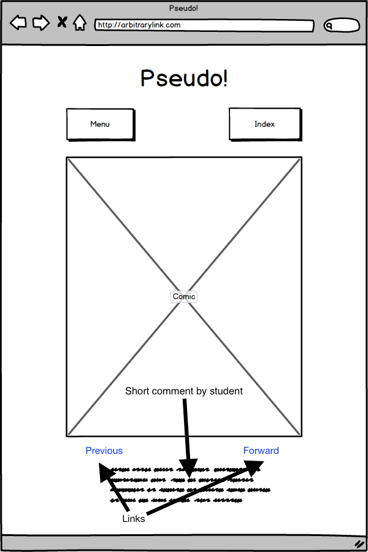
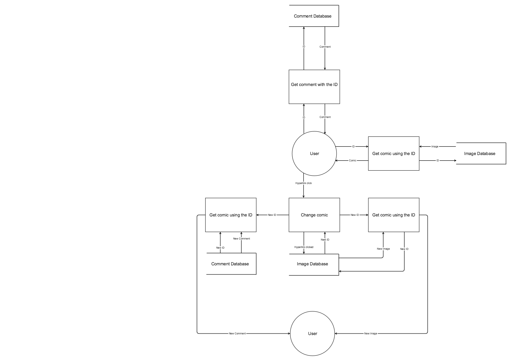
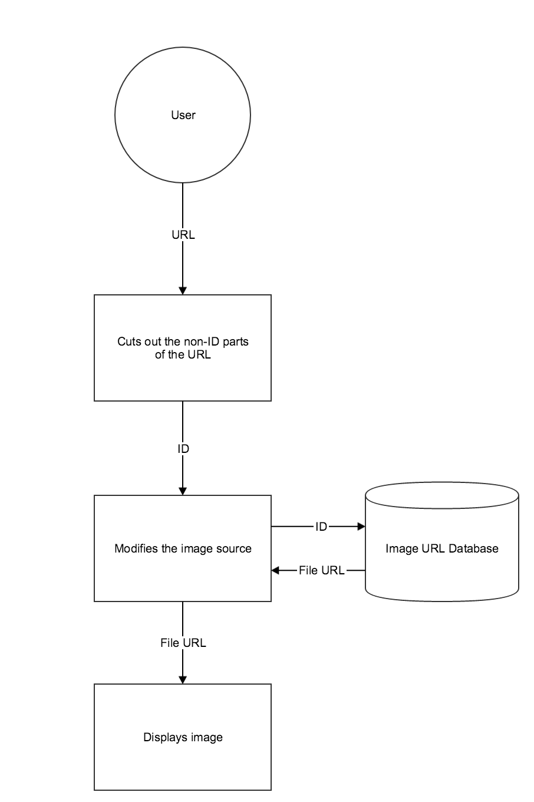
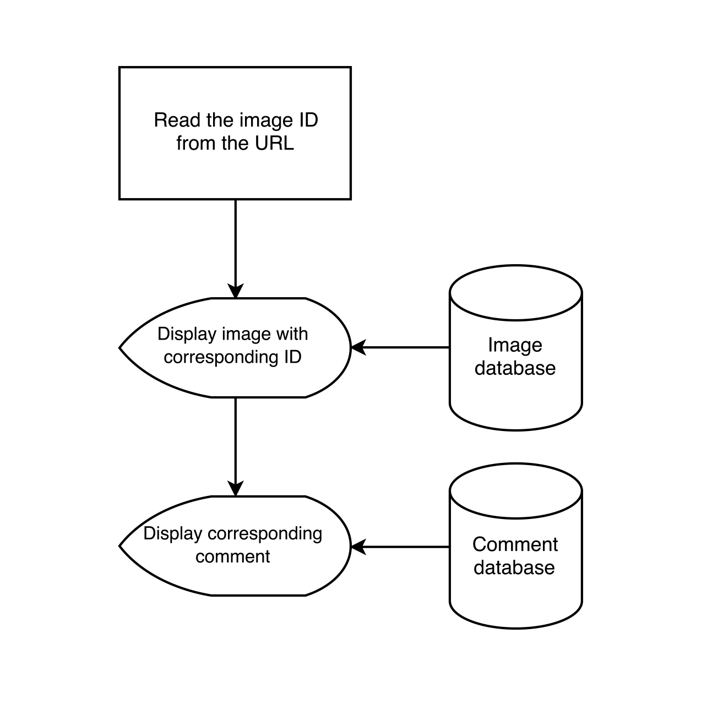

# Problem Specification

## Problem Definition
A student wishes to take his Software Design and Development notes visually as opposed to textually to improve his memory retention and his ability to relearn forgotten material, as this method assists him in doing so. However, he often loses his notes and often gets confused over the order of the notes themselves. In order to stop him from losing his notes as well as to make them available to other students, he decides to digitise them and publish them to the Internet on a website he has coded himself. The solution will enable him to push images to the main website, where they can be published along with a small note about its content. Viewers will be able to browse the files (sorted by syllabus point covered) through an index page. These files can be accessed through a URL in the form of www.(urlname).com/(X)(Y)(Z)(A)/ where X.Y.Z is the syllabus point it covers and A determines the order in which they are displayed.

## Needs & Objectives

### Needs
- Needs to allow the student to push images to the main website.
  The student will be able to add images and pages to the website using a pre-built template. All that should remain for him to do is add the image itself.
- Needs to sort the files uploaded by syllabus point.
  The viewers who are interested in browsing the topics under a certain syllabus point will be able to go to a centralised index page where all the files are sorted by the syllabus point they cover. This will make the user experience easier and it will be significantly more efficient than having to sort through the files using criteria such as date, name etc.
- Needs to sort the pages according to the URL system.
- Needs to accommodate small notes the student himself posts.
  To aid the student's own retention and the comprehension of the viewers, the pages will also allow small notes written by the student.

### Objectives
- To be able to push images to the main website using a website utility secured with a username and password.
  The student will be able to add images and their comments to the website through a page. This page will be secured with a username and password system to stop unauthorised uploads to the website. The password will also have to be hashed in order to prevent unauthorised attacks on the database.
- The website could also show pageviews and other statistics of the page.

## Boundaries & Constraints

### Boundaries
- The program should be limited to a web application.
  The program could possibly be ported to a localised web application, however, the difficulty of performing this task is probably too difficult to ensure a working application would be built in the time constraints enforced by the Major Work deadline. As such the program should stay a web application for the time being.

### Constraints
- Due to a lack of funding i.e. zero, premium plugins and APIs are not able to be used. This constraint also extends to web server hosting and other services that require money to operate.
- As there is significant difficulty involved in learning a new language and its features, this code base will attempt to use as little code written in unfamiliar programming languages as possible while also ensuring a functional end product. This can result in work-arounds or suboptimal solutions for the sake of ensuring that the solution is completed on time and is as fully functional as possible.

# Prototyping/Screen Designs



## Justification of the Features of the Software
The features of the software include:
- An index page which automatically sorts all image files given to it.
  This feature helps to improve the user experience greatly. Since most users' purpose in visiting the site is to study, by filing all pages using their syllabus point users can study certain syllabus points and review the information provided. If this feature was not included, then the users would have to trawl through potentially hundreds of webpages in order to find the one they want, not to mention the fact that they could also be out of order, adding another factor to the inefficiency involved in this process.
- The dynamic creation of several webpages according to images pushed to the website.
  Without this feature, the student would have to manually create webpages for every image that he wanted to upload. Instead, now a webpage can be created every time he uploads an image, streamlining the process significantly and ensuring that more time can be spent on ensuring that the content is rich with information as opposed to manually copy-pasting the same information into the webpage he wants to create.
- A secure portal from which to push images on the website.
  Instead of having to go to the web server and change its contents manually the student can simply go to the website itself and upload the image, where the page that hosts the image can be created (as detailed above). However, if this feature was unsecured, strangers wishing to attack the website could upload SQL injections or other malware. Hence why the portal needs to be secured with a username and a password in order to ensure that no unwanted users have the ability to upload images.

## Justification of the GUI Features
<input type=checkbox> A menu bar to navigate through the various main pages of the website. This ensures that the users can easily access the index page, which is the most important part of the entire website. Constantly having to append "index.html" to the webpage's address would result in a loss of time for the user and severely inconvenience them. Adding an index hyperlink to the menu bar would ease the user experience and keep the process streamlined.</input>
<br>
<input type=checkbox> Navigation buttons to go back and forward between each page involved with the same syllabus point. Upon reaching the end of all content covering that point, the navigation button will go forward a syllabus point and the same going backward a syllabus point. This will make sure that the user's study experience is not interrupted by having to do anything other than press a button to move forward a point.</input>
<br>

# Algorithms

**Bubblesort**

```
BEGIN bubbleSort(list):
  WHILE true:
    swapped = false
    index = 0
    WHILE index < length of list - 1:
      IF list[index] > list[index + 1]:
        swap list[index] and list[index + 1]
        swapped = true
      ENDIF
    ENDWHILE
    IF swapped == false:
      break
    ENDIF
  ENDWHILE
END bubbleSort
```

**Binary Search**

```
BEGIN binarySearch(sortedList, target):
  WHILE true:
    half = floor of (length of sortedList / 2)
    IF target < sortedList[half]:
      half = floor of (half / 2)
    ELIF target > sortedList[half]:
      half = floor of (3 * half / 4)
    ELSE:
      return half
    ENDIF
  ENDWHILE
END binarySearch
```

# Data Flow Diagrams

**L1**



**L2**



# Flowchart



# Data Dictionary

|Name|Description|Type|Validation|Used Where|
|----|-----------|----|----------|----------|
|CurrentImage|The actual image to be displayed|.png file|If it is a .png file|The comics page|
|ImageID|The ID used to identify the image to be displayed|Integer|If it matches a file in the images folder|In the displayImage function|
|Password|The password used to access the secure image upload portal|String|If it is a string|The image upload portal|
|HashedPassword|The hashed version of the password|Hexadecimal string|NA|The image upload portal|
|ComicList|The list of comics in a directory and their IDs|Array|If the comics exist and the IDs are in the syllabus|The comic display page|
|ComicRegex|The regex used to extract all the image IDs|Regular expression|The image ID extraction function|The comic database|
|IsAdmin|If the user has the correct password for the image upload|Boolean|The admin page|The admin page|
|RequireList|The list of gems required for the website|Gemfile|If the gems are of the correct version|The base code of the website|
|UploadImage|The image to be uploaded to the website|.png file|If it is a .png file|The admin page|
|CommentsList|The list of author comments and their respective comics|Dictionary/Hashmap|If the comics exist|The comic display page|
